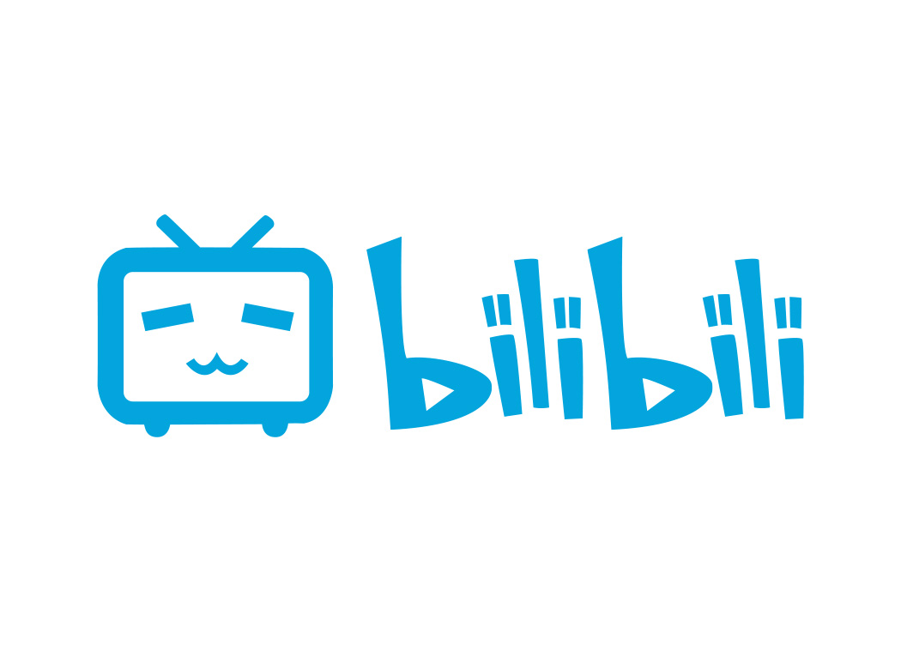
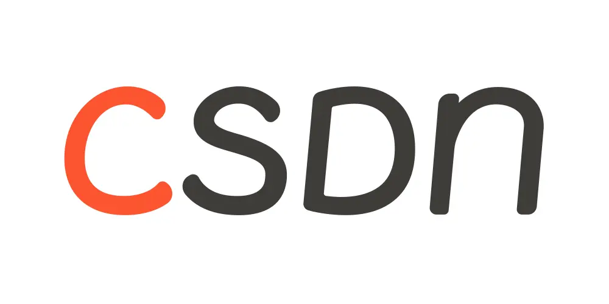

&nbsp;&nbsp;&nbsp;&nbsp;&nbsp;&nbsp;&nbsp;&nbsp;&nbsp;&nbsp;&nbsp;&nbsp;&nbsp;&nbsp;&nbsp;&nbsp;&nbsp;&nbsp;&nbsp;&nbsp;

&nbsp;&nbsp;&nbsp;&nbsp;&nbsp;&nbsp;&nbsp;&nbsp;&nbsp;&nbsp;&nbsp;&nbsp;&nbsp;&nbsp;&nbsp;&nbsp;&nbsp;&nbsp;

  今天是 2022 年 8 月 29 日，又是充满希望的一天，让我们一起大步迈向前！

  <h2>我这个人</h2>
  <ul>
    <li>🖐️&nbsp;&nbsp;哈喽，我是张跑跑</li><li>📝&nbsp;&nbsp;喜欢总结，热衷分享</li><li>🌱&nbsp;&nbsp;持续学习，茁壮成长</li><li>🏋️&nbsp;&nbsp;热爱健身，撸铁小伙</li><li>🏖️&nbsp;&nbsp;认真工作，认真生活</li>
  </ul>

  <h2>我的社交</h2>
  <table>
    <thead align="left">
      <tr>
        <th width="150">平台</th>
        <th>主要做啥</th>
        <th>状态</th>
      </tr>
    </thead>
    <tbody>
      <tr>
        <td>
          
        </td>
        <td>
          
录制了一些视频

          <ul>
            <li><a href="https://space.bilibili.com/1886509243/channel/collectiondetail?sid=77008&ctype=0" target="_blank">vue3.2 详细教程</a></li><li><a href="https://space.bilibili.com/1886509243/channel/collectiondetail?sid=104738&ctype=0" target="_blank">JavaScript 手写轮子系列</a></li><li><a href="https://space.bilibili.com/1886509243/channel/collectiondetail?sid=607494&ctype=0" target="_blank">用JavaScript 来学《算法4》</a></li>
          </ul>
        </td>
        <td>持续录制中，近期主要录制算法4系列</td>
      </tr><tr>
        <td>
          
        </td>
        <td>
          
写了一些文章

          <ul>
            <li>记录一下有趣的知识</li><li>总结自己的学习和生活</li><li>面试记录</li>
          </ul>
        </td>
        <td>会一直写下去的，惟愿马不停蹄，手不停笔</td>
      </tr><tr>
        <td>
          
        </td>
        <td>
          
算是一个小惊喜

          <ul>
            <li>发发自己的状态</li><li>一个和大家聚集的方式</li>
          </ul>
        </td>
        <td>希望自己能持续的做下去吧</td>
      </tr>
    </tbody>
  </table>

  <h2>我的小笔记</h2>
  <h4>
    因为挺喜欢总结和记录的，所有当某个点有了一些内容后，我就喜欢把它整理然后写成一本书，这样既可以分享又可以很好的查找
  </h4>
  <table>
    <thead align="center">
      <tr>
        <th width="100">封面</th>
        <th width="250">书名</th>
        <th>摘要</th>
        <th>状态</th>
      </tr>
    </thead>
    <tbody>
      <tr>
        <td>设计中...</td>
        <td>《手写 JavaScript 轮子》</td>
        <td>一起来手写前端的轮子</td>
        <td>第一期已完成，目前在准备第二期了</td>
      </tr><tr>
        <td>设计中...</td>
        <td><a href="https://alg.linlove.cn/" target="_blank">用 JavaScript 来学《算法4》</a></td>
        <td>算法可谓程序猿必备技能，一起来用 JavaScript 来学《算法4》</td>
        <td>持续中</td>
      </tr>
    </tbody>
  </table>

  <h2>我的小项目</h2>
  <h4>
    写了很多有趣的项目，有的挺成型的，有的也就是个 demo，不过都是一点点写出来的
  </h4>
  <table>
    <thead align="center">
      <tr>
        <th>项目名</th>
        <th>简述</th>
        <th>状态</th>
      </tr>
    </thead>
    <tbody>
    <tr>
        <td>
          <a href="https://github.com/zhangpaopao0609/magic-wheel" target="_blank" >
            magic-wheel
          </a>
        </td>
        <td>手写轮子配套代码</td>
        <td>跟随轮子一起转</td>
      </tr><tr>
        <td>
          <a href="https://github.com/zhangpaopao0609/format-import" target="_blank" >
            format-import
          </a>
        </td>
        <td>vscode 插件，用于规范项目中模块引用方法、组件</td>
        <td>已发布到市场，可以使用</td>
      </tr>
    </tbody>
  </table>

